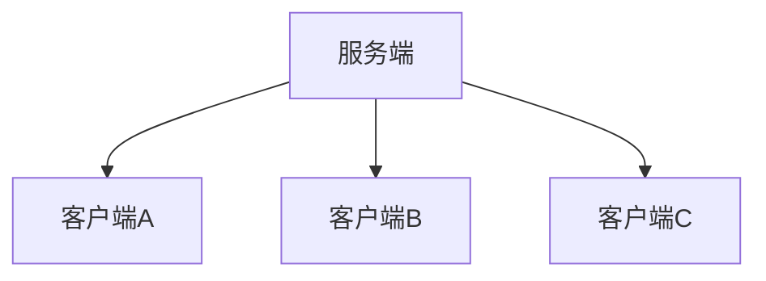
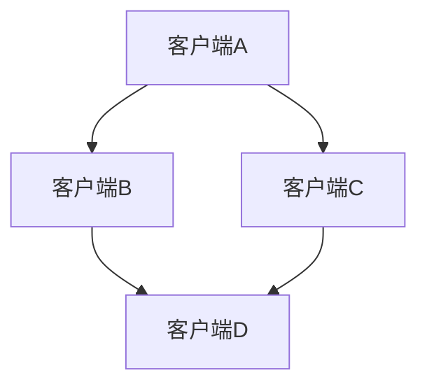

# Git 学习笔记

## 学习目标

- 了解Git基本概念
- 能够概述Git工作流程
- 能够使用常见的Git命令
- 熟悉Git代码托管服务
- 能够使用IDEA操作Git

## 概述

Git，全称是分布式版本控制系统，git通常在编程中会用到，并且git支持分布式部署，可以有效、高速的处理从很小到非常大的项目版本管理。分布式相比于集中式的最大区别在于开发者可以提交到本地，每个开发者通过克隆（git clone），在本地机器上拷贝一个完整的Git仓库。

Git是一个分布式的版本控制工具。

## SVN和Git的区别

### SVN

简介：SVN是一个中央式的版本控制器，主要分为两个部分，服务器端和客户端。

- 客户端：客户端就是用户使用的部分，通过其将用户数据传送到服务器端。
- 服务端：服务端就是类似一个中央的服务器，所有的用户和其数据内容都在这个服务器上。

所有的客户端都把数据传送到服务端，集中式保存和处理数据。

### Git

简介：Git是一个分布式的版本控制工具，没有中央的服务端，每个节点都是相对于任意一个节点都是独立且平等存在的，任意节点之间都可以进行交互。

每个节点之间都是可以进行交互的。

## Git工作流程

 

命令如下：

1. clone（克隆）：从远程仓库中克隆代码到本地仓库
2. checkout（检出）：从本地放苦衷