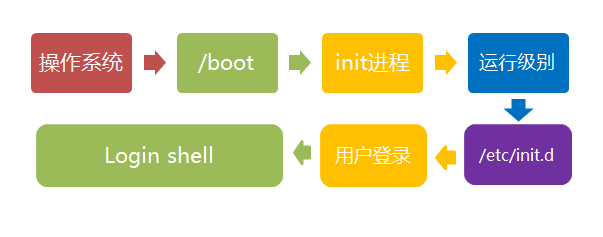

> hello大家好，我是codermast。我创建了一个知识星球，永久免费，里面分享很多关于计算机相关知识的信息，无论你是大一刚入学的小萌新，还是大四才醒悟想找工作的老学长。又或者是打算计算机考研，你在这里都能够获得到你想要的信息。
>
> 
>
> 如果你目前都没有这方面的打算，你也可以进来看看。凑凑热闹，看看大家都是如何准备的，有些时候的有些东西你是毫无意识的错过，多看看学长学姐的考研分享，或者想了解一些职场上的技巧经验，你都可以加入，或许你在这里并不能收获到很多专业性的知识和技术，但你可能因此确定了人生的努力方向，这亦是本星球带给你最大的收获。
>
> 欢迎你的加入💝！我们在这里等你。也欢迎大家关注我的个人公众号 ==爱编程的mast==，会分享一些我在学习生活中我觉得有意义的事情，也希望能带给你们帮助。谢谢！
>
> 

# Linux学习笔记

> 本篇文章主要适用0基础的读者，内容会比较通俗易懂，也会有详细的图解教程，以及运行后的返回结果。我本人在系统性的学习linux系统之前，几乎可以说是0基础，仅仅会使用ssh远程连接linux，执行指令。但是对于指令的具体内容也是完全不懂的。故本文的目标是尽最大可能的去解决一些新手在学习中的常见但是又不容易被发现的错误。很多时候遇到的问题其实是很简单的，但是由于不知道如何去解决，问题过于简单，但自己又无法解决，相信读者肯定有过这种体会，因为问题难以解决，故迫不得已放弃学习。网络上有这样一句话，学习编程语言最难的就是基础环境的搭建，也就是设置环境变量。故《从入门到精通》很多人把重点放在了精通上，但我觉得最重要的是入门。——一个切身体会过的入门coder。

本文的内容分为两大部分，Linux系统和Linux命令两大部分，读者不必从头观看。只需要选择自己想要学习的部分即可。

## 一、Linux系统

### 1.简介

Linux 内核最初只是由芬兰人林纳斯·托瓦兹（Linus Torvalds）在赫尔辛基大学上学时出于个人爱好而编写的。

Linux 是一套免费使用和自由传播的类 Unix 操作系统，是一个基于 POSIX 和 UNIX 的多用户、多任务、支持多线程和多 CPU 的操作系统。

Linux 能运行主要的 UNIX 工具软件、应用程序和网络协议。它支持 32 位和 64 位硬件。Linux 继承了 Unix 以网络为核心的设计思想，是一个性能稳定的多用户网络操作系统。

#### 1.1 Linux 的发行版

>  Linux 的发行版说简单点就是将 Linux 内核与应用软件做一个打包。目前市面上较知名的发行版有：Ubuntu、RedHat、CentOS、Debian、Fedora、SuSE、OpenSUSE、Arch Linux、SolusOS 等。


#### 1.2 Linux vs Windows

目前国内 Linux 更多的是应用于服务器上，而桌面操作系统更多使用的是 Windows。主要区别如下

| 比较     | Windows                                                      | Linux                                                        |
| :------- | :----------------------------------------------------------- | :----------------------------------------------------------- |
| 界面     | 界面统一，外壳程序固定所有 Windows 程序菜单几乎一致，快捷键也几乎相同 | 图形界面风格依发布版不同而不同，可能互不兼容。GNU/Linux 的终端机是从 UNIX 传承下来，基本命令和操作方法也几乎一致。 |
| 驱动程序 | 驱动程序丰富，版本更新频繁。默认安装程序里面一般包含有该版本发布时流行的硬件驱动程序，之后所出的新硬件驱动依赖于硬件厂商提供。对于一些老硬件，如果没有了原配的驱动有时很难支持。另外，有时硬件厂商未提供所需版本的 Windows 下的驱动，也会比较头痛。 | 由志愿者开发，由 Linux 核心开发小组发布，很多硬件厂商基于版权考虑并未提供驱动程序，尽管多数无需手动安装，但是涉及安装则相对复杂，使得新用户面对驱动程序问题（是否存在和安装方法）会一筹莫展。但是在开源开发模式下，许多老硬件尽管在Windows下很难支持的也容易找到驱动。HP、Intel、AMD 等硬件厂商逐步不同程度支持开源驱动，问题正在得到缓解。 |
| 使用     | 使用比较简单，容易入门。图形化界面对没有计算机背景知识的用户使用十分有利。 | 图形界面使用简单，容易入门。文字界面，需要学习才能掌握。     |
| 学习     | 系统构造复杂、变化频繁，且知识、技能淘汰快，深入学习困难。   | 系统构造简单、稳定，且知识、技能传承性好，深入学习相对容易。 |
| 软件     | 每一种特定功能可能都需要商业软件的支持，需要购买相应的授权。 | 大部分软件都可以自由获取，同样功能的软件选择较少。           |

### 2.安装

> 我们大部分的安装应用场景都在虚拟机上，通常在生产环境主要是使用云服务器，而云服务器主要是由厂商预装。故这里主要学习在本地环境上对虚拟机的安装。目前国内主要使用的是centos，故这里以centos为例进行学习。

1. 下载系统镜像

> 下载镜像，我们去centos官网寻找下载地址。地址：[https://www.centos.org/download/](https://www.centos.org/download/)


> 这里需要选择你电脑适配的版本，x86或者arm。如果是mac m系列芯片，就选择arm架构的镜像。如果这里下载错了，后面是无法运行的。我选择的是 Centos Stream 8 arm版本，点击即可跳转到镜像源下载地址。


选择好安装的版本，然后我们先不要着急去下载，当你点击跳转到下载源的时候，你会看到很多的版本，选择一个适合你的版本。一般情况下装系统就选择DVD标准版即可。

- CentOS-7.0-x86_64-DVD-1503-01.iso : 标准安装版，一般下载这个就可以了（推荐）
- CentOS-7.0-x86_64-NetInstall-1503-01.iso : 网络安装镜像（从网络安装或者救援系统）
- CentOS-7.0-x86_64-Everything-1503-01.iso: 对完整版安装盘的软件进行补充，集成所有软件。（包含centos7的一套完整的软件包，可以用来安装系统或者填充本地镜像）
- CentOS-7.0-x86_64-GnomeLive-1503-01.iso: GNOME桌面版
- CentOS-7.0-x86_64-KdeLive-1503-01.iso: KDE桌面版
- CentOS-7.0-x86_64-livecd-1503-01.iso : 光盘上运行的系统，类拟于winpe
- CentOS-7.0-x86_64-minimal-1503-01.iso : 精简版，自带的软件最少


> 选择一个下载源，这里随便选择一个，对于你下载比较快的即可下载。

2. 下载虚拟化程序

对于虚拟化程序的选择，主流的虚拟化程序分为两块。一个是windows系统上比较好的Vmware，另一个是mac系统上的paraller。现在vmware也已经适配了m系列芯片，只不过性能在mac上没有paraller好，其余地方差距不是很大，这里就使用paraller演示。

> Vmware官网：https://www.vmware.com
>
> Parallels官网：https://www.parallels.cn/

可以直接去官网下载，但是会比较慢，自己找一个对应自己系统的版本下载即可。这里不做演示。


3. 创建虚拟机

> 这里选择安装windows或其他操作系统（从DVD或镜像文件），点击继续


> 点击继续完成以后，这里会自动扫描你下载到的镜像文件，如果你下载了，但是没有扫到，点击下面的手动选择，选中你下载的镜像文件即可。


> 点击创建即可创建成功。

4. 运行虚拟机


这里我的电脑内安装了两个虚拟机，点击这个开关机按钮即可运行。首次运行时需要根据指令安装系统，填写信息即可。

> 这是我安装好的系统。


在电脑上安装双系统的步骤基本上差不多，但不同厂商的bios系统不一致，这里不是我们的重点，需要的去百度即可，教程很多很详细。

### 3.启动过程

Linux启动时我们会看到许多启动信息。

Linux系统的启动过程并不是大家想象中的那么复杂，其过程可以分为5个阶段：

1. 内核的引导。
2. 运行 init。
3. 系统初始化。
4. 建立终端 。
5. 用户登录系统。

> init程序的类型：
>
> - **SysV:** init, CentOS 5之前, 配置文件： /etc/inittab。
> - **Upstart:** init,CentOS 6, 配置文件： /etc/inittab, /etc/init/*.conf。
> - **Systemd：** systemd, CentOS 7,配置文件： /usr/lib/systemd/system、 /etc/systemd/system。

#### 3.1内核引导

当计算机打开电源后，首先是BIOS开机自检，按照BIOS中设置的启动设备（通常是硬盘）来启动。

操作系统接管硬件以后，首先读入 /boot 目录下的内核文件。


------

#### 3.2运行init

init 进程是系统所有进程的起点，你可以把它比拟成系统所有进程的老祖宗，没有这个进程，系统中任何进程都不会启动。

init 程序首先是需要读取配置文件 /etc/inittab。


---

#### 3.3运行级别

许多程序需要开机启动。它们在Windows叫做"服务"（service），在Linux就叫做"守护进程"（daemon）。

init进程的一大任务，就是去运行这些开机启动的程序。

但是，不同的场合需要启动不同的程序，比如用作服务器时，需要启动Apache，用作桌面就不需要。

Linux允许为不同的场合，分配不同的开机启动程序，这就叫做"运行级别"（runlevel）。也就是说，启动时根据"运行级别"，确定要运行哪些程序。


Linux系统有7个运行级别(runlevel)：

- 运行级别0：系统停机状态，系统默认运行级别不能设为0，否则不能正常启动
- 运行级别1：单用户工作状态，root权限，用于系统维护，禁止远程登录
- 运行级别2：多用户状态(没有NFS)
- 运行级别3：完全的多用户状态(有NFS)，登录后进入控制台命令行模式
- 运行级别4：系统未使用，保留
- 运行级别5：X11控制台，登录后进入图形GUI模式
- 运行级别6：系统正常关闭并重启，默认运行级别不能设为6，否则不能正常启动

------

#### 3.4系统初始化

在init的配置文件中有这么一行： si::sysinit:/etc/rc.d/rc.sysinit　它调用执行了/etc/rc.d/rc.sysinit，而rc.sysinit是一个bash shell的脚本，它主要是完成一些系统初始化的工作，rc.sysinit是每一个运行级别都要首先运行的重要脚本。

它主要完成的工作有：激活交换分区，检查磁盘，加载硬件模块以及其它一些需要优先执行任务。

```
l5:5:wait:/etc/rc.d/rc 5
```

这一行表示以5为参数运行/etc/rc.d/rc，/etc/rc.d/rc是一个Shell脚本，它接受5作为参数，去执行/etc/rc.d/rc5.d/目录下的所有的rc启动脚本，/etc/rc.d/rc5.d/目录中的这些启动脚本实际上都是一些连接文件，而不是真正的rc启动脚本，真正的rc启动脚本实际上都是放在/etc/rc.d/init.d/目录下。

而这些rc启动脚本有着类似的用法，它们一般能接受start、stop、restart、status等参数。

/etc/rc.d/rc5.d/中的rc启动脚本通常是K或S开头的连接文件，对于以 S 开头的启动脚本，将以start参数来运行。

而如果发现存在相应的脚本也存在K打头的连接，而且已经处于运行态了(以/var/lock/subsys/下的文件作为标志)，则将首先以stop为参数停止这些已经启动了的守护进程，然后再重新运行。

这样做是为了保证是当init改变运行级别时，所有相关的守护进程都将重启。

至于在每个运行级中将运行哪些守护进程，用户可以通过chkconfig或setup中的"System Services"来自行设定。


----

#### 3.5用户登录系统

一般来说，用户的登录方式有三种：

- （1）命令行登录
- （2）ssh登录
- （3）图形界面登录


对于运行级别为5的图形方式用户来说，他们的登录是通过一个图形化的登录界面。登录成功后可以直接进入 KDE、Gnome 等窗口管理器。

而本文主要讲的还是文本方式登录的情况：当我们看到mingetty的登录界面时，我们就可以输入用户名和密码来登录系统了。

Linux 的账号验证程序是 login，login 会接收 mingetty 传来的用户名作为用户名参数。

然后 login 会对用户名进行分析：如果用户名不是 root，且存在 /etc/nologin 文件，login 将输出 nologin 文件的内容，然后退出。

这通常用来系统维护时防止非root用户登录。只有/etc/securetty中登记了的终端才允许 root 用户登录，如果不存在这个文件，则 root 用户可以在任何终端上登录。

/etc/usertty文件用于对用户作出附加访问限制，如果不存在这个文件，则没有其他限制。

------

#### 图形模式与文字模式的切换方式

Linux预设提供了六个命令窗口终端机让我们来登录。

默认我们登录的就是第一个窗口，也就是tty1，这个六个窗口分别为tty1,tty2 … tty6，你可以按下Ctrl + Alt + F1 ~ F6 来切换它们。

如果你安装了图形界面，默认情况下是进入图形界面的，此时你就可以按Ctrl + Alt + F1 ~ F6来进入其中一个命令窗口界面。

当你进入命令窗口界面后再返回图形界面只要按下Ctrl + Alt + F7 就回来了。

如果你用的vmware 虚拟机，命令窗口切换的快捷键为 Alt + Space + F1~F6. 如果你在图形界面下请按Alt + Shift + Ctrl + F1~F6 切换至命令窗口。



### 4.系统目录结构

在系统根目录下运行`ls`或者`ll`指令可以查看本目录下的所有文件。


> 树状目录结构


以下是对这些目录的解释：

- **/bin**：
  bin 是 Binaries (二进制文件) 的缩写, 这个目录存放着最经常使用的命令。

- **/boot：**
  这里存放的是启动 Linux 时使用的一些核心文件，包括一些连接文件以及镜像文件。

- **/dev ：**
  dev 是 Device(设备) 的缩写, 该目录下存放的是 Linux 的外部设备，在 Linux 中访问设备的方式和访问文件的方式是相同的。

- **/etc：**
  etc 是 Etcetera(等等) 的缩写,这个目录用来存放所有的系统管理所需要的配置文件和子目录。

- **/home**：
  用户的主目录，在 Linux 中，每个用户都有一个自己的目录，一般该目录名是以用户的账号命名的，如上图中的 alice、bob 和 eve。

- **/lib**：
  lib 是 Library(库) 的缩写这个目录里存放着系统最基本的动态连接共享库，其作用类似于 Windows 里的 DLL 文件。几乎所有的应用程序都需要用到这些共享库。

- **/lost+found**：
  这个目录一般情况下是空的，当系统非法关机后，这里就存放了一些文件。

- **/media**：
  linux 系统会自动识别一些设备，例如U盘、光驱等等，当识别后，Linux 会把识别的设备挂载到这个目录下。

- **/mnt**：
  系统提供该目录是为了让用户临时挂载别的文件系统的，我们可以将光驱挂载在 /mnt/ 上，然后进入该目录就可以查看光驱里的内容了。

- **/opt**：
  opt 是 optional(可选) 的缩写，这是给主机额外安装软件所摆放的目录。比如你安装一个ORACLE数据库则就可以放到这个目录下。默认是空的。

- **/proc**：
  proc 是 Processes(进程) 的缩写，/proc 是一种伪文件系统（也即虚拟文件系统），存储的是当前内核运行状态的一系列特殊文件，这个目录是一个虚拟的目录，它是系统内存的映射，我们可以通过直接访问这个目录来获取系统信息。
  这个目录的内容不在硬盘上而是在内存里，我们也可以直接修改里面的某些文件，比如可以通过下面的命令来屏蔽主机的ping命令，使别人无法ping你的机器：

  ```shell
  echo 1 > /proc/sys/net/ipv4/icmp_echo_ignore_all
  ```

- **/root**：
  该目录为系统管理员，也称作超级权限者的用户主目录。

- **/sbin**：
  s 就是 Super User 的意思，是 Superuser Binaries (超级用户的二进制文件) 的缩写，这里存放的是系统管理员使用的系统管理程序。

- **/selinux**：
   这个目录是 Redhat/CentOS 所特有的目录，Selinux 是一个安全机制，类似于 windows 的防火墙，但是这套机制比较复杂，这个目录就是存放selinux相关的文件的。

- **/srv**：
   该目录存放一些服务启动之后需要提取的数据。

- **/sys**：

  这是 Linux2.6 内核的一个很大的变化。该目录下安装了 2.6 内核中新出现的一个文件系统 sysfs 。

  sysfs 文件系统集成了下面3种文件系统的信息：针对进程信息的 proc 文件系统、针对设备的 devfs 文件系统以及针对伪终端的 devpts 文件系统。

  该文件系统是内核设备树的一个直观反映。

  当一个内核对象被创建的时候，对应的文件和目录也在内核对象子系统中被创建。

- **/tmp**：
  tmp 是 temporary(临时) 的缩写这个目录是用来存放一些临时文件的。

- **/usr**：
   usr 是 unix shared resources(共享资源) 的缩写，这是一个非常重要的目录，用户的很多应用程序和文件都放在这个目录下，类似于 windows 下的 program files 目录。

- **/usr/bin：**
  系统用户使用的应用程序。

- **/usr/sbin：**
  超级用户使用的比较高级的管理程序和系统守护程序。

- **/usr/src：**
  内核源代码默认的放置目录。

- **/var**：
  var 是 variable(变量) 的缩写，这个目录中存放着在不断扩充着的东西，我们习惯将那些经常被修改的目录放在这个目录下。包括各种日志文件。

- **/run**：
  是一个临时文件系统，存储系统启动以来的信息。当系统重启时，这个目录下的文件应该被删掉或清除。如果你的系统上有 /var/run 目录，应该让它指向 run。

在 Linux 系统中，有几个目录是比较重要的，平时需要注意不要误删除或者随意更改内部文件。

**/etc**： 上边也提到了，这个是系统中的配置文件，如果你更改了该目录下的某个文件可能会导致系统不能启动。

**/bin, /sbin, /usr/bin, /usr/sbin**: 这是系统预设的执行文件的放置目录，比如 **ls** 就是在 **/bin/ls** 目录下的。

值得提出的是 **/bin**、**/usr/bin** 是给系统用户使用的指令（除 root 外的通用用户），而/sbin, /usr/sbin 则是给 root 使用的指令。

**/var**： 这是一个非常重要的目录，系统上跑了很多程序，那么每个程序都会有相应的日志产生，而这些日志就被记录到这个目录下，具体在 /var/log 目录下，另外 mail 的预设放置也是在这里。

### 5.SSH连接

我们在使用linux时，绝大多数都是作为服务器来使用，并不直接通过图形化界面去操作linux，而服务器通常是存放在数据中心，也就是机房中。所以我们并不能直接去机房操作服务器，这时我们通常使用远程连接的方式进行控制和维护。

linux中使用的是ssh服务实现的远程登录连接，默认的ssh端口号为22。

> 市面上可供使用的ssh客户端有很多，这里以Termius这款多平台的工具来进行演示。

#### 5.1启动linux服务器

> 我们使用的是本地环境的虚拟机，所以这里只需要打开虚拟机即可。如果是服务器，直接开机服务器即可。

#### 5.2获取服务器IP

> 你如果是服务器，那么在你购买服务器时会分发给你两个IP地址，一个是公网IP，一个是内网IP。这里连接使用的是内网IP。

这里主要演示一下虚拟机如何获取IP地址。

1. 打开虚拟机内的终端工具。


2. 执行`ifconfig`指令


3. 拿到IP地址

执行完的返回信息内的第二行中的`inet`对应的就是我们虚拟机的IP地址。

> 这里的IP不同于服务器的IP，这里是内网IP，只能在同一个网络内使用，而公网IP是可以在互联网中使用。

#### 5.3打开Termius

1. 新建一个host连接


2. 输入连接信息


3. 连接到Linux


> 到这里我们就连接成功了。

### 6.文件目录系统

#### Linux 文件基本属性

Linux 系统是一种典型的多用户系统，不同的用户处于不同的地位，拥有不同的权限。

为了保护系统的安全性，Linux 系统对不同的用户访问同一文件（包括目录文件）的权限做了不同的规定。

在 Linux 中我们通常使用以下两个命令来修改文件或目录的所属用户与权限：

- chown (change owner) ： 修改所属用户与组。
- chmod (change mode) ： 修改用户的权限。

下图中通过 chown 来授权用户，通过 chmod 为用户设置可以开门的权限。


在 Linux 中我们可以使用 **ll** 或者 **ls –l** 命令来显示一个文件的属性以及文件所属的用户和组，如：

```shell
[root@www /]# ls -l
total 64
dr-xr-xr-x   2 root root 4096 Dec 14  2012 bin
dr-xr-xr-x   4 root root 4096 Apr 19  2012 boot
……
```

实例中，**bin** 文件的第一个属性用 **d** 表示。**d** 在 Linux 中代表该文件是一个目录文件。

在 Linux 中第一个字符代表这个文件是目录、文件或链接文件等等。

- 当为 **d** 则是目录
- 当为 **-** 则是文件；
- 若是 **l** 则表示为链接文档(link file)；
- 若是 **b** 则表示为装置文件里面的可供储存的接口设备(可随机存取装置)；
- 若是 **c** 则表示为装置文件里面的串行端口设备，例如键盘、鼠标(一次性读取装置)。

接下来的字符中，以三个为一组，且均为 **rwx** 的三个参数的组合。其中， **r** 代表可读(read)、 **w** 代表可写(write)、 **x** 代表可执行(execute)。 要注意的是，这三个权限的位置不会改变，如果没有权限，就会出现减号 **-** 而已。


每个文件的属性由左边第一部分的 10 个字符来确定（如下图）。


从左至右用 **0-9** 这些数字来表示。

第 **0** 位确定文件类型，第 **1-3** 位确定属主（该文件的所有者）拥有该文件的权限。

第4-6位确定属组（所有者的同组用户）拥有该文件的权限，第7-9位确定其他用户拥有该文件的权限。

其中，第 **1、4、7** 位表示读权限，如果用 **r** 字符表示，则有读权限，如果用 **-** 字符表示，则没有读权限；

第 **2、5、8** 位表示写权限，如果用 **w** 字符表示，则有写权限，如果用 **-** 字符表示没有写权限；第 **3、6、9** 位表示可执行权限，如果用 **x** 字符表示，则有执行权限，如果用 **-** 字符表示，则没有执行权限。

------

#### Linux文件属主和属组

```shell
[root@www /]# ls -l
total 64
drwxr-xr-x 2 root  root  4096 Feb 15 14:46 cron
drwxr-xr-x 3 mysql mysql 4096 Apr 21  2014 mysql
……
```

对于文件来说，它都有一个特定的所有者，也就是对该文件具有所有权的用户。

同时，在Linux系统中，用户是按组分类的，一个用户属于一个或多个组。

文件所有者以外的用户又可以分为文件所属组的同组用户和其他用户。

因此，Linux系统按文件所有者、文件所有者同组用户和其他用户来规定了不同的文件访问权限。

在以上实例中，mysql 文件是一个目录文件，属主和属组都为 mysql，属主有可读、可写、可执行的权限；与属主同组的其他用户有可读和可执行的权限；其他用户也有可读和可执行的权限。

对于 root 用户来说，一般情况下，文件的权限对其不起作用。

------

#### 更改文件属性

##### 1.chgrp：更改文件属组

语法：

```shell
chgrp [-R] 属组名 文件名
```

参数选项

- -R：递归更改文件属组，就是在更改某个目录文件的属组时，如果加上-R的参数，那么该目录下的所有文件的属组都会更改。

##### 2.chown：更改文件属主，也可以同时更改文件属组

语法：

```shell
chown [–R] 属主名 文件名
chown [-R] 属主名：属组名 文件名
```

进入 /root 目录（~）将install.log的拥有者改为bin这个账号：

```shell
[root@www ~] cd ~
[root@www ~]# chown bin install.log
[root@www ~]# ls -l
-rw-r--r--  1 bin  users 68495 Jun 25 08:53 install.log
```

将install.log的拥有者与群组改回为root：

```shell
[root@www ~]# chown root:root install.log
[root@www ~]# ls -l
-rw-r--r--  1 root root 68495 Jun 25 08:53 install.log
```

##### 3.chmod：更改文件9个属性

Linux文件属性有两种设置方法，一种是数字，一种是符号。

Linux 文件的基本权限就有九个，分别是 **owner/group/others(拥有者/组/其他)** 三种身份各有自己的 **read/write/execute** 权限。

先复习一下刚刚上面提到的数据：文件的权限字符为： **-rwxrwxrwx** ， 这九个权限是三个三个一组的！其中，我们可以使用数字来代表各个权限，各权限的分数对照表如下：

- r:4
- w:2
- x:1

每种身份(owner/group/others)各自的三个权限(r/w/x)分数是需要累加的，例如当权限为： **-rwxrwx---** 分数则是：

- owner = rwx = 4+2+1 = 7
- group = rwx = 4+2+1 = 7
- others= --- = 0+0+0 = 0

所以等一下我们设定权限的变更时，该文件的权限数字就是 **770**。变更权限的指令 chmod 的语法是这样的：

```shell
 chmod [-R] xyz 文件或目录
```

选项与参数：

- **xyz** : 就是刚刚提到的数字类型的权限属性，为 **rwx** 属性数值的相加。
- **-R** : 进行递归(recursive)的持续变更，以及连同次目录下的所有文件都会变更

举例来说，如果要将 **.bashrc** 这个文件所有的权限都设定启用，那么命令如下：

```shell
[root@www ~]# ls -al .bashrc
-rw-r--r--  1 root root 395 Jul  4 11:45 .bashrc
[root@www ~]# chmod 777 .bashrc
[root@www ~]# ls -al .bashrc
-rwxrwxrwx  1 root root 395 Jul  4 11:45 .bashrc
```

那如果要将权限变成 *-rwxr-xr--* 呢？那么权限的分数就成为 [4+2+1][4+0+1][4+0+0]=754。

#### 符号类型改变文件权限

还有一个改变权限的方法，从之前的介绍中我们可以发现，基本上就九个权限分别是：

- user：用户
- group：组
- others：其他

那么我们就可以使用 **u, g, o** 来代表三种身份的权限。

此外， **a** 则代表 **all**，即全部的身份。读写的权限可以写成 **r, w, x**，也就是可以使用下表的方式来看：

| chmod | u g o a | +(加入) -(除去) =(设定) | r w x | 文件或目录 |
| ----- | ------- | ----------------------- | ----- | ---------- |

如果我们需要将文件权限设置为 **-rwxr-xr--** ，可以使用 **chmod u=rwx,g=rx,o=r 文件名** 来设定:

```shell
#  touch test1    // 创建 test1 文件
# ls -al test1    // 查看 test1 默认权限
-rw-r--r-- 1 root root 0 Nov 15 10:32 test1
# chmod u=rwx,g=rx,o=r  test1    // 修改 test1 权限
# ls -al test1
-rwxr-xr-- 1 root root 0 Nov 15 10:32 test1
```

而如果是要将权限去掉而不改变其他已存在的权限呢？例如要拿掉全部人的可执行权限，则：

```shell
#  chmod  a-x test1
# ls -al test1
-rw-r--r-- 1 root root 0 Nov 15 10:32 test1
```

### 7.用户和用户组

Linux系统是一个多用户多任务的分时操作系统，任何一个要使用系统资源的用户，都必须首先向系统管理员申请一个账号，然后以这个账号的身份进入系统。

用户的账号一方面可以帮助系统管理员对使用系统的用户进行跟踪，并控制他们对系统资源的访问；另一方面也可以帮助用户组织文件，并为用户提供安全性保护。

每个用户账号都拥有一个唯一的用户名和各自的口令。

用户在登录时键入正确的用户名和口令后，就能够进入系统和自己的主目录。

实现用户账号的管理，要完成的工作主要有如下几个方面：

- 用户账号的添加、删除与修改。
- 用户口令的管理。
- 用户组的管理。

------

#### 7.1Linux系统用户账号的管理

用户账号的管理工作主要涉及到用户账号的添加、修改和删除。

添加用户账号就是在系统中创建一个新账号，然后为新账号分配用户号、用户组、主目录和登录Shell等资源。刚添加的账号是被锁定的，无法使用。

##### 7.1.1添加账户

```
useradd 选项 用户名
```

参数说明：

- 选项:

  - -c comment 指定一段注释性描述。
  - -d 目录 指定用户主目录，如果此目录不存在，则同时使用-m选项，可以创建主目录。
  - -g 用户组 指定用户所属的用户组。
  - -G 用户组，用户组 指定用户所属的附加组。
  - -s Shell文件 指定用户的登录Shell。
  - -u 用户号 指定用户的用户号，如果同时有-o选项，则可以重复使用其他用户的标识号。

- 用户名:

  指定新账号的登录名。

##### 7.1.2删除帐号

如果一个用户的账号不再使用，可以从系统中删除。删除用户账号就是要将/etc/passwd等系统文件中的该用户记录删除，必要时还删除用户的主目录。

删除一个已有的用户账号使用`userdel`命令，其格式如下：

```
userdel 选项 用户名
```

常用的选项是 **-r**，它的作用是把用户的主目录一起删除。

例如：

```
# userdel -r sam
```

此命令删除用户sam在系统文件中（主要是/etc/passwd, /etc/shadow, /etc/group等）的记录，同时删除用户的主目录。

##### 7.1.3修改帐号

修改用户账号就是根据实际情况更改用户的有关属性，如用户号、主目录、用户组、登录Shell等。

修改已有用户的信息使用`usermod`命令，其格式如下：

```
usermod 选项 用户名
```

常用的选项包括`-c, -d, -m, -g, -G, -s, -u以及-o等`，这些选项的意义与`useradd`命令中的选项一样，可以为用户指定新的资源值。

另外，有些系统可以使用选项：-l 新用户名

这个选项指定一个新的账号，即将原来的用户名改为新的用户名。

例如：

```
# usermod -s /bin/ksh -d /home/z –g developer sam
```

此命令将用户sam的登录Shell修改为ksh，主目录改为/home/z，用户组改为developer。

##### 7.1.4用户口令的管理

用户管理的一项重要内容是用户口令的管理。用户账号刚创建时没有口令，但是被系统锁定，无法使用，必须为其指定口令后才可以使用，即使是指定空口令。

指定和修改用户口令的Shell命令是`passwd`。超级用户可以为自己和其他用户指定口令，普通用户只能用它修改自己的口令。命令的格式为：

```
passwd 选项 用户名
```

可使用的选项：

- -l 锁定口令，即禁用账号。
- -u 口令解锁。
- -d 使账号无口令。
- -f 强迫用户下次登录时修改口令。

如果默认用户名，则修改当前用户的口令。

例如，假设当前用户是sam，则下面的命令修改该用户自己的口令：

```
$ passwd 
Old password:****** 
New password:******* 
Re-enter new password:*******
```

如果是超级用户，可以用下列形式指定任何用户的口令：

```
# passwd sam 
New password:******* 
Re-enter new password:*******
```

普通用户修改自己的口令时，passwd命令会先询问原口令，验证后再要求用户输入两遍新口令，如果两次输入的口令一致，则将这个口令指定给用户；而超级用户为用户指定口令时，就不需要知道原口令。

为了系统安全起见，用户应该选择比较复杂的口令，例如最好使用8位长的口令，口令中包含有大写、小写字母和数字，并且应该与姓名、生日等不相同。

为用户指定空口令时，执行下列形式的命令：

```
# passwd -d sam
```

此命令将用户 sam 的口令删除，这样用户 sam 下一次登录时，系统就不再允许该用户登录了。

passwd 命令还可以用 -l(lock) 选项锁定某一用户，使其不能登录，例如：

```
# passwd -l sam
```

------

#### 7.2Linux系统用户组的管理

每个用户都有一个用户组，系统可以对一个用户组中的所有用户进行集中管理。不同Linux 系统对用户组的规定有所不同，如Linux下的用户属于与它同名的用户组，这个用户组在创建用户时同时创建。

用户组的管理涉及用户组的添加、删除和修改。组的增加、删除和修改实际上就是对/etc/group文件的更新。

##### 7.2.1增加一个新的用户组使用groupadd命令。其格式如下：

```
groupadd 选项 用户组
```

可以使用的选项有：

- -g GID 指定新用户组的组标识号（GID）。
- -o 一般与-g选项同时使用，表示新用户组的GID可以与系统已有用户组的GID相同。

##### 7.2.2如果要删除一个已有的用户组，使用groupdel命令，其格式如下：

```
groupdel 用户组
```

**例如：**

```
# groupdel group1
```

此命令从系统中删除组group1。

##### 7.2.3修改用户组的属性使用groupmod命令。其语法如下：

```
groupmod 选项 用户组
```

常用的选项有：

- -g GID 为用户组指定新的组标识号。
- -o 与-g选项同时使用，用户组的新GID可以与系统已有用户组的GID相同。
- -n新用户组 将用户组的名字改为新名字

##### 7.2.4如果一个用户同时属于多个用户组，那么用户可以在用户组之间切换，以便具有其他用户组的权限。

用户可以在登录后，使用命令newgrp切换到其他用户组，这个命令的参数就是目的用户组。例如：

```
$ newgrp root
```

这条命令将当前用户切换到root用户组，前提条件是root用户组确实是该用户的主组或附加组。类似于用户账号的管理，用户组的管理也可以通过集成的系统管理工具来完成。

------

#### 7.3与用户账号有关的系统文件

完成用户管理的工作有许多种方法，但是每一种方法实际上都是对有关的系统文件进行修改。

与用户和用户组相关的信息都存放在一些系统文件中，这些文件包括/etc/passwd, /etc/shadow, /etc/group等。

下面分别介绍这些文件的内容。

##### 7.3.1/etc/passwd文件是用户管理工作涉及的最重要的一个文件。

Linux系统中的每个用户都在/etc/passwd文件中有一个对应的记录行，它记录了这个用户的一些基本属性。

这个文件对所有用户都是可读的。它的内容类似下面的例子：

```shell
＃ cat /etc/passwd

root:x:0:0:Superuser:/:
daemon:x:1:1:System daemons:/etc:
bin:x:2:2:Owner of system commands:/bin:
sys:x:3:3:Owner of system files:/usr/sys:
adm:x:4:4:System accounting:/usr/adm:
uucp:x:5:5:UUCP administrator:/usr/lib/uucp:
auth:x:7:21:Authentication administrator:/tcb/files/auth:
cron:x:9:16:Cron daemon:/usr/spool/cron:
listen:x:37:4:Network daemon:/usr/net/nls:
lp:x:71:18:Printer administrator:/usr/spool/lp:
sam:x:200:50:Sam san:/home/sam:/bin/sh
```

从上面的例子我们可以看到，/etc/passwd中一行记录对应着一个用户，每行记录又被冒号(:)分隔为7个字段，其格式和具体含义如下：

```
用户名:口令:用户标识号:组标识号:注释性描述:主目录:登录Shell
```

**1. "用户名"是代表用户账号的字符串。**

通常长度不超过8个字符，并且由大小写字母和/或数字组成。登录名中不能有冒号(:)，因为冒号在这里是分隔符。

为了兼容起见，登录名中最好不要包含点字符(.)，并且不使用连字符(-)和加号(+)打头。

**2. “口令”一些系统中，存放着加密后的用户口令字。**

虽然这个字段存放的只是用户口令的加密串，不是明文，但是由于/etc/passwd文件对所有用户都可读，所以这仍是一个安全隐患。因此，现在许多Linux 系统（如SVR4）都使用了shadow技术，把真正的加密后的用户口令字存放到/etc/shadow文件中，而在/etc/passwd文件的口令字段中只存放一个特殊的字符，例如“x”或者“*”。

**3. “用户标识号”是一个整数，系统内部用它来标识用户。**

一般情况下它与用户名是一一对应的。如果几个用户名对应的用户标识号是一样的，系统内部将把它们视为同一个用户，但是它们可以有不同的口令、不同的主目录以及不同的登录Shell等。

通常用户标识号的取值范围是0～65 535。0是超级用户root的标识号，1～99由系统保留，作为管理账号，普通用户的标识号从100开始。在Linux系统中，这个界限是500。

**4.“组标识号”字段记录的是用户所属的用户组。**

它对应着/etc/group文件中的一条记录。

**5.“注释性描述”字段记录着用户的一些个人情况。**

例如用户的真实姓名、电话、地址等，这个字段并没有什么实际的用途。在不同的Linux 系统中，这个字段的格式并没有统一。在许多Linux系统中，这个字段存放的是一段任意的注释性描述文字，用做finger命令的输出。

**6.“主目录”，也就是用户的起始工作目录。**

它是用户在登录到系统之后所处的目录。在大多数系统中，各用户的主目录都被组织在同一个特定的目录下，而用户主目录的名称就是该用户的登录名。各用户对自己的主目录有读、写、执行（搜索）权限，其他用户对此目录的访问权限则根据具体情况设置。

**7.用户登录后，要启动一个进程，负责将用户的操作传给内核，这个进程是用户登录到系统后运行的命令解释器或某个特定的程序，即Shell。**

Shell是用户与Linux系统之间的接口。Linux的Shell有许多种，每种都有不同的特点。常用的有sh(Bourne Shell), csh(C Shell), ksh(Korn Shell), tcsh(TENEX/TOPS-20 type C Shell), bash(Bourne Again Shell)等。

系统管理员可以根据系统情况和用户习惯为用户指定某个Shell。如果不指定Shell，那么系统使用sh为默认的登录Shell，即这个字段的值为/bin/sh。

用户的登录Shell也可以指定为某个特定的程序（此程序不是一个命令解释器）。

利用这一特点，我们可以限制用户只能运行指定的应用程序，在该应用程序运行结束后，用户就自动退出了系统。有些Linux 系统要求只有那些在系统中登记了的程序才能出现在这个字段中。

**8.系统中有一类用户称为伪用户（pseudo users）。**

这些用户在/etc/passwd文件中也占有一条记录，但是不能登录，因为它们的登录Shell为空。它们的存在主要是方便系统管理，满足相应的系统进程对文件属主的要求。

常见的伪用户如下所示：

```
伪 用 户 含 义 
bin 拥有可执行的用户命令文件 
sys 拥有系统文件 
adm 拥有帐户文件 
uucp UUCP使用 
lp lp或lpd子系统使用 
nobody NFS使用
```

------

##### 7.3.2拥有帐户文件

**1、除了上面列出的伪用户外，还有许多标准的伪用户，例如：audit, cron, mail, usenet等，它们也都各自为相关的进程和文件所需要。**

由于/etc/passwd文件是所有用户都可读的，如果用户的密码太简单或规律比较明显的话，一台普通的计算机就能够很容易地将它破解，因此对安全性要求较高的Linux系统都把加密后的口令字分离出来，单独存放在一个文件中，这个文件是/etc/shadow文件。 有超级用户才拥有该文件读权限，这就保证了用户密码的安全性。

**2、/etc/shadow中的记录行与/etc/passwd中的一一对应，它由pwconv命令根据/etc/passwd中的数据自动产生**

它的文件格式与/etc/passwd类似，由若干个字段组成，字段之间用":"隔开。这些字段是：

```
登录名:加密口令:最后一次修改时间:最小时间间隔:最大时间间隔:警告时间:不活动时间:失效时间:标志
```

1. "登录名"是与/etc/passwd文件中的登录名相一致的用户账号
2. "口令"字段存放的是加密后的用户口令字，长度为13个字符。如果为空，则对应用户没有口令，登录时不需要口令；如果含有不属于集合 { ./0-9A-Za-z }中的字符，则对应的用户不能登录。
3. "最后一次修改时间"表示的是从某个时刻起，到用户最后一次修改口令时的天数。时间起点对不同的系统可能不一样。例如在SCO Linux 中，这个时间起点是1970年1月1日。
4. "最小时间间隔"指的是两次修改口令之间所需的最小天数。
5. "最大时间间隔"指的是口令保持有效的最大天数。
6. "警告时间"字段表示的是从系统开始警告用户到用户密码正式失效之间的天数。
7. "不活动时间"表示的是用户没有登录活动但账号仍能保持有效的最大天数。
8. "失效时间"字段给出的是一个绝对的天数，如果使用了这个字段，那么就给出相应账号的生存期。期满后，该账号就不再是一个合法的账号，也就不能再用来登录了。

下面是/etc/shadow的一个例子：

```
＃ cat /etc/shadow

root:Dnakfw28zf38w:8764:0:168:7:::
daemon:*::0:0::::
bin:*::0:0::::
sys:*::0:0::::
adm:*::0:0::::
uucp:*::0:0::::
nuucp:*::0:0::::
auth:*::0:0::::
cron:*::0:0::::
listen:*::0:0::::
lp:*::0:0::::
sam:EkdiSECLWPdSa:9740:0:0::::
```

**3、用户组的所有信息都存放在/etc/group文件中。**

将用户分组是Linux 系统中对用户进行管理及控制访问权限的一种手段。

每个用户都属于某个用户组；一个组中可以有多个用户，一个用户也可以属于不同的组。

当一个用户同时是多个组中的成员时，在/etc/passwd文件中记录的是用户所属的主组，也就是登录时所属的默认组，而其他组称为附加组。

用户要访问属于附加组的文件时，必须首先使用newgrp命令使自己成为所要访问的组中的成员。

用户组的所有信息都存放在/etc/group文件中。此文件的格式也类似于/etc/passwd文件，由冒号(:)隔开若干个字段，这些字段有：

```
组名:口令:组标识号:组内用户列表
```

1. "组名"是用户组的名称，由字母或数字构成。与/etc/passwd中的登录名一样，组名不应重复。
2. "口令"字段存放的是用户组加密后的口令字。一般Linux 系统的用户组都没有口令，即这个字段一般为空，或者是*。
3. "组标识号"与用户标识号类似，也是一个整数，被系统内部用来标识组。
4. "组内用户列表"是属于这个组的所有用户的列表，不同用户之间用逗号(,)分隔。这个用户组可能是用户的主组，也可能是附加组。

/etc/group文件的一个例子如下：

```
root::0:root
bin::2:root,bin
sys::3:root,uucp
adm::4:root,adm
daemon::5:root,daemon
lp::7:root,lp
users::20:root,sam
```

#### 7.4添加批量用户

添加和删除用户对每位Linux系统管理员都是轻而易举的事，比较棘手的是如果要添加几十个、上百个甚至上千个用户时，我们不太可能还使用useradd一个一个地添加，必然要找一种简便的创建大量用户的方法。Linux系统提供了创建大量用户的工具，可以让您立即创建大量用户，方法如下：

**（1）先编辑一个文本用户文件。**

每一列按照`/etc/passwd`密码文件的格式书写，要注意每个用户的用户名、UID、宿主目录都不可以相同，其中密码栏可以留做空白或输入x号。一个范例文件user.txt内容如下：

```
user001::600:100:user:/home/user001:/bin/bash
user002::601:100:user:/home/user002:/bin/bash
user003::602:100:user:/home/user003:/bin/bash
user004::603:100:user:/home/user004:/bin/bash
user005::604:100:user:/home/user005:/bin/bash
user006::605:100:user:/home/user006:/bin/bash
```

**（2）以root身份执行命令 `/usr/sbin/newusers`，从刚创建的用户文件`user.txt`中导入数据，创建用户：**

```
# newusers < user.txt
```

然后可以执行命令 `vipw` 或 `vi /etc/passwd` 检查 `/etc/passwd` 文件是否已经出现这些用户的数据，并且用户的宿主目录是否已经创建。

**（3）执行命令/usr/sbin/pwunconv**。

将 `/etc/shadow` 产生的 `shadow` 密码解码，然后回写到 `/etc/passwd` 中，并将`/etc/shadow`的`shadow`密码栏删掉。这是为了方便下一步的密码转换工作，即先取消 `shadow password` 功能。

```
# pwunconv
```

**（4）编辑每个用户的密码对照文件。**

格式为：

```
用户名:密码
```

实例文件 `passwd.txt` 内容如下：

```
user001:123456
user002:123456
user003:123456
user004:123456
user005:123456
user006:123456
```

**（5）以 root 身份执行命令 `/usr/sbin/chpasswd`。**

创建用户密码，`chpasswd` 会将经过 `/usr/bin/passwd` 命令编码过的密码写入 `/etc/passwd` 的密码栏。

```
# chpasswd < passwd.txt
```

**（6）确定密码经编码写入/etc/passwd的密码栏后。**

执行命令 `/usr/sbin/pwconv` 将密码编码为 `shadow password`，并将结果写入 `/etc/shadow`。

```
# pwconv
```

这样就完成了大量用户的创建了，之后您可以到/home下检查这些用户宿主目录的权限设置是否都正确，并登录验证用户密码是否正确。

### 8.磁盘管理

Linux 磁盘管理好坏直接关系到整个系统的性能问题。

Linux 磁盘管理常用三个命令为 **df**、**du** 和 **fdisk**。

- **df**（英文全称：disk free）：列出文件系统的整体磁盘使用量
- **du**（英文全称：disk used）：检查磁盘空间使用量
- **fdisk**：用于磁盘分区

------

#### df

df命令参数功能：检查文件系统的磁盘空间占用情况。可以利用该命令来获取硬盘被占用了多少空间，目前还剩下多少空间等信息。

语法：

```
df [-ahikHTm] [目录或文件名]
```

选项与参数：

- -a ：列出所有的文件系统，包括系统特有的 /proc 等文件系统；
- -k ：以 KBytes 的容量显示各文件系统；
- -m ：以 MBytes 的容量显示各文件系统；
- -h ：以人们较易阅读的 GBytes, MBytes, KBytes 等格式自行显示；
- -H ：以 M=1000K 取代 M=1024K 的进位方式；
- -T ：显示文件系统类型, 连同该 partition 的 filesystem 名称 (例如 ext3) 也列出；
- -i ：不用硬盘容量，而以 inode 的数量来显示

#### du

Linux du 命令也是查看使用空间的，但是与 df 命令不同的是 Linux du 命令是对文件和目录磁盘使用的空间的查看，还是和df命令有一些区别的，这里介绍 Linux du 命令。

语法：

```
du [-ahskm] 文件或目录名称
```

选项与参数：

- -a ：列出所有的文件与目录容量，因为默认仅统计目录底下的文件量而已。
- -h ：以人们较易读的容量格式 (G/M) 显示；
- -s ：列出总量而已，而不列出每个各别的目录占用容量；
- -S ：不包括子目录下的总计，与 -s 有点差别。
- -k ：以 KBytes 列出容量显示；
- -m ：以 MBytes 列出容量显示；

#### fdisk

fdisk 是 Linux 的磁盘分区表操作工具。

语法：

```
fdisk [-l] 装置名称
```

选项与参数：

- -l ：输出后面接的装置所有的分区内容。若仅有 fdisk -l 时， 则系统将会把整个系统内能够搜寻到的装置的分区均列出来。

想要不储存离开吗？按下 q 就对了！不要随便按 w 啊！

使用 `p` 可以列出目前这颗磁盘的分割表信息，这个信息的上半部在显示整体磁盘的状态。

------

#### 磁盘格式化

磁盘分割完毕后自然就是要进行文件系统的格式化，格式化的命令非常的简单，使用 `mkfs`（make filesystem） 命令。

语法：

```
mkfs [-t 文件系统格式] 装置文件名
```

选项与参数：

- -t ：可以接文件系统格式，例如 ext3, ext2, vfat 等(系统有支持才会生效)

------

#### 磁盘检验

fsck（file system check）用来检查和维护不一致的文件系统。

若系统掉电或磁盘发生问题，可利用fsck命令对文件系统进行检查。

语法：

```
fsck [-t 文件系统] [-ACay] 装置名称
```

选项与参数：

- -t : 给定档案系统的型式，若在 /etc/fstab 中已有定义或 kernel 本身已支援的则不需加上此参数
- -s : 依序一个一个地执行 fsck 的指令来检查
- -A : 对/etc/fstab 中所有列出来的 分区（partition）做检查
- -C : 显示完整的检查进度
- -d : 打印出 e2fsck 的 debug 结果
- -p : 同时有 -A 条件时，同时有多个 fsck 的检查一起执行
- -R : 同时有 -A 条件时，省略 / 不检查
- -V : 详细显示模式
- -a : 如果检查有错则自动修复
- -r : 如果检查有错则由使用者回答是否修复
- -y : 选项指定检测每个文件是自动输入yes，在不确定那些是不正常的时候，可以执行 # fsck -y 全部检查修复。

如果没有加上 -f 的选项，则由于这个文件系统不曾出现问题，检查的经过非常快速！若加上 -f 强制检查，才会一项一项的显示过程。

------

#### 磁盘挂载与卸除

Linux 的磁盘挂载使用 `mount` 命令，卸载使用 `umount` 命令。

磁盘挂载语法：

```
mount [-t 文件系统] [-L Label名] [-o 额外选项] [-n]  装置文件名  挂载点
```

磁盘卸载命令 `umount` 语法：

```
umount [-fn] 装置文件名或挂载点
```

选项与参数：

- -f ：强制卸除！可用在类似网络文件系统 (NFS) 无法读取到的情况下；
- -n ：不升级 /etc/mtab 情况下卸除。

卸载/dev/hdc6

```
[root@www ~]# umount /dev/hdc6     
```

### 9.Vi/Vim

所有的 Unix Like 系统都会内建 vi 文书编辑器，其他的文书编辑器则不一定会存在。

但是目前我们使用比较多的是 vim 编辑器。

vim 具有程序编辑的能力，可以主动的以字体颜色辨别语法的正确性，方便程序设计。

#### 什么是 vim？

Vim 是从 vi 发展出来的一个文本编辑器。代码补全、编译及错误跳转等方便编程的功能特别丰富，在程序员中被广泛使用。

简单的来说， vi 是老式的字处理器，不过功能已经很齐全了，但是还是有可以进步的地方。 vim 则可以说是程序开发者的一项很好用的工具。

连 vim 的官方网站 (https://www.vim.org/) 自己也说 vim 是一个程序开发工具而不是文字处理软件。

vim 键盘图：


------

#### vi/vim 的使用

基本上 vi/vim 共分为三种模式，分别是**命令模式（Command mode）**，**输入模式（Insert mode）**和**底线命令模式（Last line mode）**。 这三种模式的作用分别是：

##### 命令模式：

用户刚刚启动 vi/vim，便进入了命令模式。

此状态下敲击键盘动作会被Vim识别为命令，而非输入字符。比如我们此时按下i，并不会输入一个字符，i被当作了一个命令。

以下是常用的几个命令：

- **i** 切换到输入模式，以输入字符。
- **x** 删除当前光标所在处的字符。
- **:** 切换到底线命令模式，以在最底一行输入命令。

若想要编辑文本：启动Vim，进入了命令模式，按下i，切换到输入模式。

命令模式只有一些最基本的命令，因此仍要依靠底线命令模式输入更多命令。

##### 输入模式

在命令模式下按下i就进入了输入模式。

在输入模式中，可以使用以下按键：

- **字符按键以及Shift组合**，输入字符
- **ENTER**，回车键，换行
- **BACK SPACE**，退格键，删除光标前一个字符
- **DEL**，删除键，删除光标后一个字符
- **方向键**，在文本中移动光标
- **HOME**/**END**，移动光标到行首/行尾
- **Page Up**/**Page Down**，上/下翻页
- **Insert**，切换光标为输入/替换模式，光标将变成竖线/下划线
- **ESC**，退出输入模式，切换到命令模式

##### 底线命令模式

在命令模式下按下:（英文冒号）就进入了底线命令模式。

底线命令模式可以输入单个或多个字符的命令，可用的命令非常多。

在底线命令模式中，基本的命令有（已经省略了冒号）：

- q 退出程序
- w 保存文件

按ESC键可随时退出底线命令模式。

简单的说，我们可以将这三个模式想成底下的图标来表示：


------

#### vi/vim 使用实例

##### 使用 vi/vim 进入一般模式

如果你想要使用 vi 来建立一个名为 codermast.txt 的文件时，你可以这样做：

```shell
$ vi codermast.txt
```

>  直接输入 **vi 文件名** 就能够进入 vi 的一般模式了。请注意，记得 vi 后面一定要加文件名，不管该文件存在与否！文件存在时会打开文件，文件不存在时会自动创建文件。


##### 按下 i 进入输入模式(也称为编辑模式)，开始编辑文字

在一般模式之中，只要按下 i, o, a 等字符就可以进入输入模式了！

在编辑模式当中，你可以发现在左下角状态栏中会出现 –INSERT插入- 的字样，那就是可以输入任意字符的提示。

这个时候，键盘上除了 **Esc** 这个按键之外，其他的按键都可以视作为一般的输入按钮了，所以你可以进行任何的编辑。


##### 按下 ESC 按钮回到一般模式

好了，假设我已经按照上面的样式给他编辑完毕了，那么应该要如何退出呢？是的！没错！就是给他按下 **Esc** 这个按钮即可！马上你就会发现画面左下角的 – INSERT – 不见了！

##### 在一般模式中按下 **:wq** 储存后离开 vi

OK，我们要存档了，存盘并离开的指令很简单，输入 **:wq** 即可保存离开！


OK! 这样我们就成功创建了一个 codermast.txt 的文件。

------

#### vi/vim 按键说明

除了上面简易范例的 i, Esc, :wq 之外，其实 vim 还有非常多的按键可以使用。

##### 第一部分：一般模式可用的光标移动、复制粘贴、搜索替换等

| 移动光标的方法                                               |                                                              |
| :----------------------------------------------------------- | ------------------------------------------------------------ |
| h 或 向左箭头键(←)                                           | 光标向左移动一个字符                                         |
| j 或 向下箭头键(↓)                                           | 光标向下移动一个字符                                         |
| k 或 向上箭头键(↑)                                           | 光标向上移动一个字符                                         |
| l 或 向右箭头键(→)                                           | 光标向右移动一个字符                                         |
| 如果你将右手放在键盘上的话，你会发现 hjkl 是排列在一起的，因此可以使用这四个按钮来移动光标。 如果想要进行多次移动的话，例如向下移动 30 行，可以使用 "30j" 或 "30↓" 的组合按键， 亦即加上想要进行的次数(数字)后，按下动作即可！ |                                                              |
| [Ctrl] + [f]                                                 | 屏幕『向下』移动一页，相当于 [Page Down]按键 (常用)          |
| [Ctrl] + [b]                                                 | 屏幕『向上』移动一页，相当于 [Page Up] 按键 (常用)           |
| [Ctrl] + [d]                                                 | 屏幕『向下』移动半页                                         |
| [Ctrl] + [u]                                                 | 屏幕『向上』移动半页                                         |
| +                                                            | 光标移动到非空格符的下一行                                   |
| -                                                            | 光标移动到非空格符的上一行                                   |
| n<space>                                                     | 那个 n 表示『数字』，例如 20 。按下数字后再按空格键，光标会向右移动这一行的 n 个字符。例如 20<space> 则光标会向后面移动 20 个字符距离。 |
| 0 或功能键[Home]                                             | 这是数字『 0 』：移动到这一行的最前面字符处 (常用)           |
| $ 或功能键[End]                                              | 移动到这一行的最后面字符处(常用)                             |
| H                                                            | 光标移动到这个屏幕的最上方那一行的第一个字符                 |
| M                                                            | 光标移动到这个屏幕的中央那一行的第一个字符                   |
| L                                                            | 光标移动到这个屏幕的最下方那一行的第一个字符                 |
| G                                                            | 移动到这个档案的最后一行(常用)                               |
| nG                                                           | n 为数字。移动到这个档案的第 n 行。例如 20G 则会移动到这个档案的第 20 行(可配合 :set nu) |
| gg                                                           | 移动到这个档案的第一行，相当于 1G 啊！ (常用)                |
| n<Enter>                                                     | n 为数字。光标向下移动 n 行(常用)                            |
| 搜索替换                                                     |                                                              |
| /word                                                        | 向光标之下寻找一个名称为 word 的字符串。例如要在档案内搜寻 vbird 这个字符串，就输入 /vbird 即可！ (常用) |
| ?word                                                        | 向光标之上寻找一个字符串名称为 word 的字符串。               |
| n                                                            | 这个 n 是英文按键。代表重复前一个搜寻的动作。举例来说， 如果刚刚我们执行 /vbird 去向下搜寻 vbird 这个字符串，则按下 n 后，会向下继续搜寻下一个名称为 vbird 的字符串。如果是执行 ?vbird 的话，那么按下 n 则会向上继续搜寻名称为 vbird 的字符串！ |
| N                                                            | 这个 N 是英文按键。与 n 刚好相反，为『反向』进行前一个搜寻动作。 例如 /vbird 后，按下 N 则表示『向上』搜寻 vbird 。 |
| 使用 /word 配合 n 及 N 是非常有帮助的！可以让你重复的找到一些你搜寻的关键词！ |                                                              |
| :n1,n2s/word1/word2/g                                        | n1 与 n2 为数字。在第 n1 与 n2 行之间寻找 word1 这个字符串，并将该字符串取代为 word2 ！举例来说，在 100 到 200 行之间搜寻 vbird 并取代为 VBIRD 则： 『:100,200s/vbird/VBIRD/g』。(常用) |
| **:1,$s/word1/word2/g** 或 **:%s/word1/word2/g**             | 从第一行到最后一行寻找 word1 字符串，并将该字符串取代为 word2 ！(常用) |
| **:1,$s/word1/word2/gc** 或 **:%s/word1/word2/gc**           | 从第一行到最后一行寻找 word1 字符串，并将该字符串取代为 word2 ！且在取代前显示提示字符给用户确认 (confirm) 是否需要取代！(常用) |
| 删除、复制与贴上                                             |                                                              |
| x, X                                                         | 在一行字当中，x 为向后删除一个字符 (相当于 [del] 按键)， X 为向前删除一个字符(相当于 [backspace] 亦即是退格键) (常用) |
| nx                                                           | n 为数字，连续向后删除 n 个字符。举例来说，我要连续删除 10 个字符， 『10x』。 |
| dd                                                           | 剪切游标所在的那一整行(常用)，用 p/P 可以粘贴。              |
| ndd                                                          | n 为数字。剪切光标所在的向下 n 行，例如 20dd 则是剪切 20 行(常用)，用 p/P 可以粘贴。 |
| d1G                                                          | 删除光标所在到第一行的所有数据                               |
| dG                                                           | 删除光标所在到最后一行的所有数据                             |
| d$                                                           | 删除游标所在处，到该行的最后一个字符                         |
| d0                                                           | 那个是数字的 0 ，删除游标所在处，到该行的最前面一个字符      |
| yy                                                           | 复制游标所在的那一行(常用)                                   |
| nyy                                                          | n 为数字。复制光标所在的向下 n 行，例如 20yy 则是复制 20 行(常用) |
| y1G                                                          | 复制游标所在行到第一行的所有数据                             |
| yG                                                           | 复制游标所在行到最后一行的所有数据                           |
| y0                                                           | 复制光标所在的那个字符到该行行首的所有数据                   |
| y$                                                           | 复制光标所在的那个字符到该行行尾的所有数据                   |
| p, P                                                         | p 为将已复制的数据在光标下一行贴上，P 则为贴在游标上一行！ 举例来说，我目前光标在第 20 行，且已经复制了 10 行数据。则按下 p 后， 那 10 行数据会贴在原本的 20 行之后，亦即由 21 行开始贴。但如果是按下 P 呢？ 那么原本的第 20 行会被推到变成 30 行。 (常用) |
| J                                                            | 将光标所在行与下一行的数据结合成同一行                       |
| c                                                            | 重复删除多个数据，例如向下删除 10 行，[ 10cj ]               |
| u                                                            | 复原前一个动作。(常用)                                       |
| [Ctrl]+r                                                     | 重做上一个动作。(常用)                                       |
| 这个 u 与 [Ctrl]+r 是很常用的指令！一个是复原，另一个则是重做一次～ 利用这两个功能按键，你的编辑，嘿嘿！很快乐的啦！ |                                                              |
| .                                                            | 不要怀疑！这就是小数点！意思是重复前一个动作的意思。 如果你想要重复删除、重复贴上等等动作，按下小数点『.』就好了！ (常用) |

##### 第二部分：一般模式切换到编辑模式的可用的按钮说明

| 进入输入或取代的编辑模式                                     |                                                              |
| :----------------------------------------------------------- | ------------------------------------------------------------ |
| i, I                                                         | 进入输入模式(Insert mode)： i 为『从目前光标所在处输入』， I 为『在目前所在行的第一个非空格符处开始输入』。 (常用) |
| a, A                                                         | 进入输入模式(Insert mode)： a 为『从目前光标所在的下一个字符处开始输入』， A 为『从光标所在行的最后一个字符处开始输入』。(常用) |
| o, O                                                         | 进入输入模式(Insert mode)： 这是英文字母 o 的大小写。o 为在目前光标所在的下一行处输入新的一行； O 为在目前光标所在的上一行处输入新的一行！(常用) |
| r, R                                                         | 进入取代模式(Replace mode)： r 只会取代光标所在的那一个字符一次；R会一直取代光标所在的文字，直到按下 ESC 为止；(常用) |
| 上面这些按键中，在 vi 画面的左下角处会出现『--INSERT--』或『--REPLACE--』的字样。 由名称就知道该动作了吧！！特别注意的是，我们上面也提过了，你想要在档案里面输入字符时， 一定要在左下角处看到 INSERT 或 REPLACE 才能输入喔！ |                                                              |
| [Esc]                                                        | 退出编辑模式，回到一般模式中(常用)                           |

##### 第三部分：一般模式切换到指令行模式的可用的按钮说明

| 指令行的储存、离开等指令                                     |                                                              |
| :----------------------------------------------------------- | ------------------------------------------------------------ |
| :w                                                           | 将编辑的数据写入硬盘档案中(常用)                             |
| :w!                                                          | 若文件属性为『只读』时，强制写入该档案。不过，到底能不能写入， 还是跟你对该档案的档案权限有关啊！ |
| :q                                                           | 离开 vi (常用)                                               |
| :q!                                                          | 若曾修改过档案，又不想储存，使用 ! 为强制离开不储存档案。    |
| 注意一下啊，那个惊叹号 (!) 在 vi 当中，常常具有『强制』的意思～ |                                                              |
| :wq                                                          | 储存后离开，若为 :wq! 则为强制储存后离开 (常用)              |
| ZZ                                                           | 这是大写的 Z 喔！如果修改过，保存当前文件，然后退出！效果等同于(保存并退出) |
| ZQ                                                           | 不保存，强制退出。效果等同于 **:q!**。                       |
| :w [filename]                                                | 将编辑的数据储存成另一个档案（类似另存新档）                 |
| :r [filename]                                                | 在编辑的数据中，读入另一个档案的数据。亦即将 『filename』 这个档案内容加到游标所在行后面 |
| :n1,n2 w [filename]                                          | 将 n1 到 n2 的内容储存成 filename 这个档案。                 |
| :! command                                                   | 暂时离开 vi 到指令行模式下执行 command 的显示结果！例如 『:! ls /home』即可在 vi 当中察看 /home 底下以 ls 输出的档案信息！ |
| vim 环境的变更                                               |                                                              |
| :set nu                                                      | 显示行号，设定之后，会在每一行的前缀显示该行的行号           |
| :set nonu                                                    | 与 set nu 相反，为取消行号！                                 |

特别注意，在 vi/vim 中，数字是很有意义的！数字通常代表重复做几次的意思！ 也有可能是代表去到第几个什么什么的意思。

举例来说，要删除 50 行，则是用 『50dd』 对吧！ 数字加在动作之前，如我要向下移动 20 行呢？那就是『20j』或者是『20↓』即可。

## 二、Linux命令

在正式学习linux命令之前，我们必须再次了解一下linux 的目录系统。尽管在第一个章节中已经了解了linux的系统目录，但是侧重点在于系统根目录下各文件夹的具体含义。那么什么是根目录呢？这个问题值得说明。

- `/`，根目录是最顶级的目录了
- Linux只有一个顶级目录：`/`，而windows中每个盘符都是一个跟目录。可以理解为Linux的目录是一个数型结构，而Windows中是一个森林。
- 路径描述的层次关系同样适用`/`来表示
- /home/codermast/a.txt，表示根目录下的home文件夹内有codermast文件夹，内有a.txt

### 1.Yum命令

yum（ Yellow dog Updater, Modified）是一个在 Fedora 和 RedHat 以及 SUSE 中的 Shell 前端软件包管理器。

基于 RPM 包管理，能够从指定的服务器自动下载 RPM 包并且安装，可以自动处理依赖性关系，并且一次安装所有依赖的软件包，无须繁琐地一次次下载、安装。

yum 提供了查找、安装、删除某一个、一组甚至全部软件包的命令，而且命令简洁而又好记。

#### yum 语法

```
yum [options] [command] [package ...]
```

- **options：**可选，选项包括-h（帮助），-y（当安装过程提示选择全部为 "yes"），-q（不显示安装的过程）等等。
- **command：**要进行的操作。
- **package：**安装的包名。

------

#### yum常用命令

- \1. 列出所有可更新的软件清单命令：**yum check-update**
- \2. 更新所有软件命令：**yum update**
- \3. 仅安装指定的软件命令：**yum install <package_name>**
- \4. 仅更新指定的软件命令：**yum update <package_name>**
- \5. 列出所有可安裝的软件清单命令：**yum list**
- \6. 删除软件包命令：**yum remove <package_name>**
- \7. 查找软件包命令：**yum search <keyword>**
- \8. 清除缓存命令:
  - **yum clean packages**: 清除缓存目录下的软件包
  - **yum clean headers**: 清除缓存目录下的 headers
  - **yum clean oldheaders**: 清除缓存目录下旧的 headers
  - **yum clean, yum clean all (= yum clean packages; yum clean oldheaders)** :清除缓存目录下的软件包及旧的 headers

**实例 1**

安装 pam-devel

```shell
[root@www ~]# yum install pam-devel
Setting up Install Process
Parsing package install arguments
Resolving Dependencies  <==先检查软件的属性相依问题
--> Running transaction check
---> Package pam-devel.i386 0:0.99.6.2-4.el5 set to be updated
--> Processing Dependency: pam = 0.99.6.2-4.el5 for package: pam-devel
--> Running transaction check
---> Package pam.i386 0:0.99.6.2-4.el5 set to be updated
filelists.xml.gz          100% |=========================| 1.6 MB    00:05
filelists.xml.gz          100% |=========================| 138 kB    00:00
-> Finished Dependency Resolution
……(省略)
```

**实例 2**

移除 pam-devel

```shell
[root@www ~]# yum remove pam-devel
Setting up Remove Process
Resolving Dependencies  <==同样的，先解决属性相依的问题
--> Running transaction check
---> Package pam-devel.i386 0:0.99.6.2-4.el5 set to be erased
--> Finished Dependency Resolution

Dependencies Resolved

=============================================================================
 Package                 Arch       Version          Repository        Size
=============================================================================
Removing:
 pam-devel               i386       0.99.6.2-4.el5   installed         495 k

Transaction Summary
=============================================================================
Install      0 Package(s)
Update       0 Package(s)
Remove       1 Package(s)  <==还好，并没有属性相依的问题，单纯移除一个软件

Is this ok [y/N]: y
Downloading Packages:
Running rpm_check_debug
Running Transaction Test
Finished Transaction Test
Transaction Test Succeeded
Running Transaction
  Erasing   : pam-devel                    ######################### [1/1]

Removed: pam-devel.i386 0:0.99.6.2-4.el5
Complete!
```

**实例 3**

利用 yum 的功能，找出以 pam 为开头的软件名称有哪些？

```shell
[root@www ~]# yum list pam*
Installed Packages
pam.i386                  0.99.6.2-3.27.el5      installed
pam_ccreds.i386           3-5                    installed
pam_krb5.i386             2.2.14-1               installed
pam_passwdqc.i386         1.0.2-1.2.2            installed
pam_pkcs11.i386           0.5.3-23               installed
pam_smb.i386              1.1.7-7.2.1            installed
Available Packages <==底下则是『可升级』的或『未安装』的
pam.i386                  0.99.6.2-4.el5         base
pam-devel.i386            0.99.6.2-4.el5         base
pam_krb5.i386             2.2.14-10              base
```

------

#### 国内 yum 源

网易（163）yum源是国内最好的yum源之一 ，无论是速度还是软件版本，都非常的不错。

将yum源设置为163 yum，可以提升软件包安装和更新的速度，同时避免一些常见软件版本无法找到。

##### 安装步骤

首先备份/etc/yum.repos.d/CentOS-Base.repo

```shell
mv /etc/yum.repos.d/CentOS-Base.repo /etc/yum.repos.d/CentOS-Base.repo.backup
```

下载对应版本 repo 文件, 放入 /etc/yum.repos.d/ (操作前请做好相应备份)

- [CentOS5](http://mirrors.163.com/.help/CentOS5-Base-163.repo) ：http://mirrors.163.com/.help/CentOS5-Base-163.repo
- [CentOS6](http://mirrors.163.com/.help/CentOS6-Base-163.repo) ：http://mirrors.163.com/.help/CentOS6-Base-163.repo
- [CentOS7](http://mirrors.163.com/.help/CentOS7-Base-163.repo) ：http://mirrors.163.com/.help/CentOS7-Base-163.repo

```shell
wget http://mirrors.163.com/.help/CentOS6-Base-163.repo
mv CentOS6-Base-163.repo CentOS-Base.repo
```

运行以下命令生成缓存

```
yum clean all
yum makecache
```

除了网易之外，国内还有其他不错的 yum 源，比如中科大和搜狐。

中科大的 yum 源，安装方法查看：https://lug.ustc.edu.cn/wiki/mirrors/help/centos

sohu 的 yum 源安装方法查看: http://mirrors.sohu.com/help/centos.html

### 2.Apt命令

apt（Advanced Packaging Tool）是一个在 Debian 和 Ubuntu 中的 Shell 前端软件包管理器。

apt 命令提供了查找、安装、升级、删除某一个、一组甚至全部软件包的命令，而且命令简洁而又好记。

apt 命令执行需要超级管理员权限(root)。

#### apt 语法

```
  apt [options] [command] [package ...]
```

- **options：**可选，选项包括 -h（帮助），-y（当安装过程提示选择全部为"yes"），-q（不显示安装的过程）等等。
- **command：**要进行的操作。
- **package**：安装的包名。

------

#### apt 常用命令

- 列出所有可更新的软件清单命令：**sudo apt update**

- 升级软件包：**sudo apt upgrade**

  列出可更新的软件包及版本信息：**apt list --upgradeable**

  升级软件包，升级前先删除需要更新软件包：**sudo apt full-upgrade**

- 安装指定的软件命令：**sudo apt install <package_name>**

  安装多个软件包：**sudo apt install <package_1> <package_2> <package_3>**

- 更新指定的软件命令：**sudo apt update <package_name>**

- 显示软件包具体信息,例如：版本号，安装大小，依赖关系等等：**sudo apt show <package_name>**

- 删除软件包命令：**sudo apt remove <package_name>**

- 清理不再使用的依赖和库文件: **sudo apt autoremove**

- 移除软件包及配置文件: **sudo apt purge <package_name>**

- 查找软件包命令： **sudo apt search <keyword>**

- 列出所有已安装的包：**apt list --installed**

- 列出所有已安装的包的版本信息：**apt list --all-versions**

**实例**

查看一些可更新的包：

```
sudo apt update
```

升级安装包：

```
sudo apt upgrade
```

> 在某些时候，需要进行确认安装。在交互式输入字母 **Y** 即可开始升级。

可以将以下两个命令组合起来，一键升级：

```
sudo apt update && sudo apt upgrade -y
```

安装 mplayer 包：

```
sudo apt install mplayer
```

### 3.ls命令

> 这个指令我们在前面也已经接触到了，相信大家都能够了解其的功能。这里做系统性的讲解。

功能：列出文件夹信息

语法：`ls [-l -h -a] [参数]`

- 参数：被查看的文件夹，不提供参数，表示查看当前工作目录
- -l，以列表形式查看
- -h，配合-l，以更加人性化的方式显示文件大小
- -a，显示隐藏文件

>  隐藏文件、文件夹，在Linux中以`.`开头的，均是隐藏的。默认不显示出来，需要`-a`选项才可查看到。

### 4.ll命令

ll命令的功能是显示指定文件或目录的详细属性信息，实际它不是一个真实存在的命令文件，而是”ls -l --color=auto“的别名而已。ll命令可以默认列出当前目录内文件的详细属性信息，包含权限、所属、修改时间以及容量占用大小等等信息。

**语法格式：**ll [参数] 文件

**常用参数：**

| -a   | 列出目录下的所有文件（含隐藏文件） |
| ---- | ---------------------------------- |
| -A   | 显示除 “.”和“..”外的所有文件       |
| -k   | 以字节的形式表示文件的大小         |
| -h   | 以更易读的容量单位显示文件大小     |
| -s   | 在每个文件名后输出该文件的大小     |
| -N   | 不限制文件长度                     |
| -t   | 以文件上次被修改的时间排序         |
| -u   | 以文件上次被访问的时间排序         |

### 5.pwd命令

功能：展示当前工作目录

语法：`pwd`


### 6.cd命令

功能：切换工作目录

语法：`cd [目标目录]`

参数：目标目录，要切换去的地方，不提供默认切换到`当前登录用户HOME目录`

### 7.home目录

每一个用户在Linux系统中都有自己的专属工作目录，称之为HOME目录。

- 普通用户的HOME目录，默认在：`/home/用户名`如：/home/codermast
- root用户的HOME目录，在：`/root`

> 在登录系统以后，默认直接进入登录用户home目录。在使用codermast账户登录后，默认进入到的是/home/codermast目录

### 8.相对、绝对路径

- 相对路径，==非==`/`开头的称之为相对路径

  相对路径表示以`当前目录`作为起点，去描述路径，如`test/a.txt`，表示当前工作目录内的test文件夹内的a.txt文件

- 绝对路径，==以==`/`开头的称之为绝对路径

  绝对路径从`根`开始描述路径

> 这里和url中的相对地址和绝对地址是类似的。

### 9.特殊路径符

- `.`，表示当前，比如./a.txt，表示当前文件夹内的`a.txt`文件
- `..`，表示上级目录，比如`../`表示上级目录，`../../`表示上级的上级目录
- `~`，表示用户的HOME目录，比如`cd ~`，即可切回用户HOME目录

### 10.mkdir

> 可以看作是make directory的缩写

功能：创建文件夹

语法：`mkdir [-p] 参数`

- 参数：被创建文件夹的路径
- 选项：-p，可选，表示创建前置路径

### 11.touch命令

功能：创建文件

语法：`touch 参数`

- 参数：被创建的文件路径

### 12.cat命令

功能：查看文件内容

语法：`cat 参数`

- 参数：被查看的文件路径

### 13.more命令

功能：查看文件，可以支持翻页查看

语法：`more 参数`

- 参数：被查看的文件路径
- 在查看过程中：
  - `空格`键翻页
  - `q`退出查看

### 14.cp命令

功能：复制文件、文件夹

语法：`cp [-r] 参数1 参数2`

- 参数1，被复制的
- 参数2，要复制去的地方
- 选项：-r，可选，复制文件夹使用

示例：

- cp a.txt b.txt，复制当前目录下a.txt为b.txt
- cp a.txt test/，复制当前目录a.txt到test文件夹内
- cp -r test test2，复制文件夹test到当前文件夹内为test2存在

### 15.mv命令

功能：移动文件、文件夹

语法：`mv 参数1 参数2`

- 参数1：被移动的
- 参数2：要移动去的地方，参数2如果不存在，则会进行改名

### 16.rm命令

功能：删除文件、文件夹

语法：`rm [-r -f] 参数...参数`

- 参数：支持多个，每一个表示被删除的，空格进行分隔
- 选项：-r，删除文件夹使用
- 选项：-f，强制删除，不会给出确认提示，一般root用户会用到

> rm命令很危险，一定要注意，特别是切换到root用户的时候。==千万不要==使用==rm -rf==在根目录下。

### 17.which命令

功能：查看命令的程序本体文件路径

语法：`which 参数`

- 参数：被查看的命令

### 18.find命令

功能：搜索文件

语法1按文件名搜索：`find 路径 -name 参数`

- 路径，搜索的起始路径
- 参数，搜索的关键字，支持通配符*， 比如：`*`test表示搜索任意以test结尾的文件

### 19.grep命令

功能：过滤关键字

语法：`grep [-n] 关键字 文件路径`

- 选项-n，可选，表示在结果中显示匹配的行的行号。
- 参数，关键字，必填，表示过滤的关键字，带有空格或其它特殊符号，建议使用””将关键字包围起来
- 参数，文件路径，必填，表示要过滤内容的文件路径，可作为内容输入端口

> 参数文件路径，可以作为管道符的输入

### 20.wc命令

功能：统计

语法：`wc [-c -m -l -w] 文件路径`

- 选项，-c，统计bytes数量
- 选项，-m，统计字符数量
- 选项，-l，统计行数
- 选项，-w，统计单词数量
- 参数，文件路径，被统计的文件，可作为内容输入端口

> 参数文件路径，可作为管道符的输入

### 21.管道符|

写法：`|`

功能：将符号左边的结果，作为符号右边的输入

示例：

`cat a.txt | grep itheima`，将cat a.txt的结果，作为grep命令的输入，用来过滤`itheima`关键字

可以支持嵌套：

`cat a.txt | grep itheima | grep itcast`

### 22.echo命令

功能：输出内容

语法：`echo 参数`

- 参数：被输出的内容

### 23.`反引号

功能：被两个反引号包围的内容，会作为命令执行

示例：

- echo \`pwd\`，会输出当前工作目录

### 24.tail命令

功能：查看文件尾部内容

语法：`tail [-f] 参数`

- 参数：被查看的文件
- 选项：-f，持续跟踪文件修改

### 25.head命令

功能：查看文件头部内容

语法：`head [-n] 参数`

- 参数：被查看的文件
- 选项：-n，查看的行数

### 26.重定向符

功能：将符号左边的结果，输出到右边指定的文件中去

- `>`，表示覆盖输出
- `>>`，表示追加输出

### 27.systemctl

功能：控制系统服务的启动关闭等

语法：`systemctl start | stop | restart | disable | enable | status 服务名`

- start，启动
- stop，停止
- status，查看状态
- disable，关闭开机自启
- enable，开启开机自启
- restart，重启

### 28.软链接

功能：创建文件、文件夹软链接（快捷方式）

语法：`ln -s 参数1 参数2`

- 参数1：被链接的
- 参数2：要链接去的地方（快捷方式的名称和存放位置）

### 29.日期

语法：`date [-d] [+格式化字符串]`

- -d 按照给定的字符串显示日期，一般用于日期计算
- 格式化字符串：通过特定的字符串标记，来控制显示的日期格式
  - %Y   年%y   年份后两位数字 (00..99)
  - %m   月份 (01..12)
  - %d   日 (01..31)
  - %H   小时 (00..23)
  - %M   分钟 (00..59)
  - %S   秒 (00..60)
  - %s   自 1970-01-01 00:00:00 UTC 到现在的秒数

### 30.修改时区

修改时区为中国时区

```shell
sudo rm -f /etc/localtime
sudo ln -s /usr/share/zoneinfo/Asia/Shanghai /etc/localtime
```

### 31.ntp

功能：同步时间

安装：`yum install -y ntp`

启动管理：`systemctl start | stop | restart | status | disable | enable ntpd`

手动校准时间：`ntpdate -u ntp.aliyun.com`

### 32.ip地址

格式：a.b.c.d

- abcd为0~255的数字

特殊IP：

- 127.0.0.1，表示本机
- 0.0.0.0
  - 可以表示本机
  - 也可以表示任意IP（看使用场景）

查看ip：`ifconfig`

### 33.主机名

功能：Linux系统的名称

查看：`hostname`

设置：`hostnamectl set-hostname 主机名`

### 34.ps命令

功能：查看进程信息

语法：`ps -ef`，查看全部进程信息，可以搭配grep做过滤：`ps -ef | grep xxx`

### 35.kill命令

```shell
kill [-s <信息名称或编号>][程序]　或　kill [-l <信息编号>]
```

**参数说明**：

- -l <信息编号> 　若不加<信息编号>选项，则 -l 参数会列出全部的信息名称。
- -s <信息名称或编号> 　指定要送出的信息。
- [程序] 　[程序]可以是程序的PID或是PGID，也可以是工作编号。

使用 kill -l 命令列出所有可用信号。

最常用的信号是：

- 1 (HUP)：重新加载进程。
- 9 (KILL)：杀死一个进程。
- 15 (TERM)：正常停止一个进程。

### 36.nmap

> 在使用nmap指令之前，我们需要先安装nmap，centos中执行`sudo yum install nmap`，需要管理员权限。

功能：查看端口的占用情况

语法：`nmap ip地址`

例如：`nmap 127.0.0.1`

### 37.netstat命令

功能：查看端口占用

用法：`netstat -anp | grep xxx`

### 38.ping命令

测试网络是否联通

语法：`ping [-c num] 参数`

- 选项：-c 检查的次数，不使用-c时会一直检测下去。
- 参数：ip地址或者url地址


### 39.wegt

wegt是非交互式的文件下载器，可以在命令行内直接从互联网上下载文件。

- 语法：`wegt [-b] url`
- 选项：-b 可选，后台下载，会将日志自动写入到当前工作目录的`wegt-log`文件
- 参数：url，下载链接

- 查看后台下载：可以使用tail命令查看后台下载进度，`tail -f wget-log`

> 注意：无论文件是否下载成功，只要下载了部分的文件，就一定会生成下载的残留文件，需要及时清理这些下载未完成不可用的文件。

### 40.curl命令

curl可以发送http网络请求，可用于：下载文件、获取信息等

语法：`curl [-o] url`

- 选项：-o，用于下载文件，当url是下载链接时，可以使用此选项保存下载文件。
- 参数：url，要发起请求的网络地址。

### 41.top命令

功能：实时查看主机运行状态

语法：`top`，查看基础信息

**参数说明**：

- d : 改变显示的更新速度，或是在交谈式指令列( interactive command)按 s
- q : 没有任何延迟的显示速度，如果使用者是有 superuser 的权限，则 top 将会以最高的优先序执行
- c : 切换显示模式，共有两种模式，一是只显示执行档的名称，另一种是显示完整的路径与名称
- S : 累积模式，会将己完成或消失的子进程 ( dead child process ) 的 CPU time 累积起来
- s : 安全模式，将交谈式指令取消, 避免潜在的危机
- i : 不显示任何闲置 (idle) 或无用 (zombie) 的进程
- n : 更新的次数，完成后将会退出 top
- b : 批次档模式，搭配 "n" 参数一起使用，可以用来将 top 的结果输出到档案内


交互模式中，可以使用快捷键：


### 42.df命令

查看磁盘占用情况

- 语法：`df [-h]`

- 选项：-h，以更加人性化的单位显示


### 43.iostat命令

查看CPU、磁盘的相关信息

- 语法：`iostat [-x] [num1] [num2]`
- 选项：
  - -x，显示更多信息
  - num1：数字，刷新间隔
  - num2：数字，刷新次数

### 44.sar命令

查看网络统计

- 语法：`sar -n DEV num1 num2`
- 选项：
  - -n，查看网络，DEV表示查看网络接口
  - num1：刷新间隔（不填就查看一次就结束）
  - num2：查看次数（不填就是无限次）

45.环境变量

- 临时设置：export 变量名=变量值
- 永久设置：
  - 针对用户，设置用户HOME目录内：`.bashrc`文件
  - 针对全局，设置`/etc/profile`

### 46.PATH变量

记录了执行程序的搜索路径

可以将自定义路径加入PATH内，实现自定义命令在任意地方均可执行的效果

### 47.$符号

可以取出指定的环境变量的值

语法：`$变量名`

示例：

`echo $PATH`，输出PATH环境变量的值

`echo ${PATH}ABC`，输出PATH环境变量的值以及ABC

如果变量名和其它内容混淆在一起，可以使用${}

### 48.压缩解压

#### 压缩

**tar类型**

- 语法：`tar -zcvf 压缩包 被压缩1...被压缩2...被压缩N`

- -z表示使用gzip，可以不写

**zip类型**

`zip [-r] 参数1 参数2 参数N`

- -r：被压缩的包含文件夹的时候，需要使用-r选项，和rm、cp等命令的效果一致。

#### 解压

**tar类型**

`tar -zxvf 被解压的文件 -C 要解压去的地方`

- -z表示使用gzip，可以省略
- -C，可以省略，指定要解压去的地方，不写解压到当前目录

**zip类型**

- 语法：`unzip [-d] 参数`
- 选项：-d，指定要解压去的位置，同tar的-c选项
- 参数：被解压的zip压缩包文件

### 49.su命令

切换用户

- 语法：`su [-] [用户]`
- 选项：- 表示切换后加载环境变量，建议带上
- 参数：用户，可以省略，默认切换到root用户

50.sudo命令

- 语法：`sudo 其他命令`

- 功能：

  - 可以让一条普通命令带有root权限

  - 需要以root用户执行visudo命令，增加配置方法可以让普通用户有sudo命令的权限。

> 在visudo中配置以后，可以让指定用户，无需密码使用sudo

### 50.chmod命令

修改文件、文件夹权限

- 语法：`chmod [-R] 权限 参数`

- 权限，要设置的权限，比如755，表示：`rwxr-xr-x`

| 权限值 | 含义       | 表示 |
| ------ | ---------- | ---- |
| 0      | 无任何权限 | ---  |
| 1      | 仅有x权限  | --x  |
| 2      | 仅有w权限  | -w-  |
| 3      | 有w和x权限 | -wx  |
| 4      | 仅有r权限  | r--  |
| 5      | 有r和x权限 | r-x  |
| 6      | 有r和w权限 | rw-  |
| 7      | 有全部权限 | rwx  |

> 权限值：r=4，w=2，x=1

- 参数，被修改的文件、文件夹
- 选项-R，设置文件夹和其内部全部内容一样生效

### 51.chown命令

修改文件、文件夹所属用户、组

- 语法：`chown [-R] [用户][:][用户组] 文件或文件夹`
- 选项：
  - -R，同chmod，对文件夹内全部内容应用相同规则。
  - 用户，修改所属用户
  - 用户组，修改所属用户组
  - ：，用于分隔用户和用户组

### 52.用户组管理

> 以下命令需要root用户执行

- 创建用户组：`groupadd 用户组名`
- 删除用户组：`groupdel 用户组名`

### 53.用户管理

> 以下命令需要root用户执行

- 创建用户：`useradd [-g] [-d] 用户名`
  - 选项：
    - -g，指定用户的组，不指定-g，会创建同名组并自动加入，指定-g需要组已经存在，如存在同名组，必须使用-g
    - -d，指定用户home路径，不指定，home目录默认在`/home/用户名`
- 删除用户：`userdel [-r] 用户名`
  - 选项：-r，删除用户的home目录，不实用-r，删除用户时，home目录保留
- 查看用户所属组：`id [用户名]`
  - 参数：用户名，被查看的用户，如果不提供，则默认查看自身用户组
- 修改用户所属组：`usermod -aG 用户组 用户名` 将指定用户加入指定用户组

### 54.genenv命令

- `getenv group`，查看系统全部的用户组

- `getenv passwd`，查看系统全部的用户

### 55.env命令

查看系统全部的环境变量

- 语法：`env`

> 以上就是我们经常使用的一些指令，其余指令并不经常使用，配合linux指令文档即可。

## 三、查看帮助

### 查看命令的帮助手册

可以通过：`命令 --help`查看命令的帮助手册

### 查看命令的详细手册

可以通过：`man 命令`查看某命令的详细手册

> 可以在命令行内查看指令的帮助文档。

> hello大家好，我是codermast。我创建了一个知识星球，永久免费，里面分享很多关于计算机相关知识的信息，无论你是大一刚入学的小萌新，还是大四才醒悟想找工作的老学长。又或者是打算计算机考研，你在这里都能够获得到你想要的信息。
>
> 
>
> 如果你目前都没有这方面的打算，你也可以进来看看。凑凑热闹，看看大家都是如何准备的，有些时候的有些东西你是毫无意识的错过，多看看学长学姐的考研分享，或者想了解一些职场上的技巧经验，你都可以加入，或许你在这里并不能收获到很多专业性的知识和技术，但你可能因此确定了人生的努力方向，这亦是本星球带给你最大的收获。
>
> 欢迎你的加入💝！我们在这里等你。也欢迎大家关注我的个人公众号 ==爱编程的mast==，会分享一些我在学习生活中我觉得有意义的事情，也希望能带给你们帮助。谢谢！
>
> 
